# 2020_OO 第五組 

### 組長:洪仁傑

### 小組成員: 黃堃博(DB)、李浩茗(後端)、李永宸(前端)、洪仁傑(PM)
---

## 題目: 銀行管理系統

### 摘要: 行員能夠使用此系統來幫客戶開戶或除戶、客戶也能使用此系統查詢明細和餘額及轉帳。

---
## 一、專案管理 -- 時程規劃&FDD
 ### (1)甘特圖
  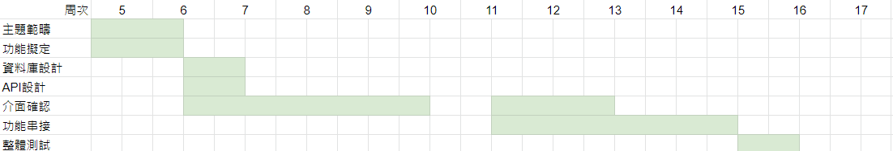
 ---
 ### (2)PERT/CPM
  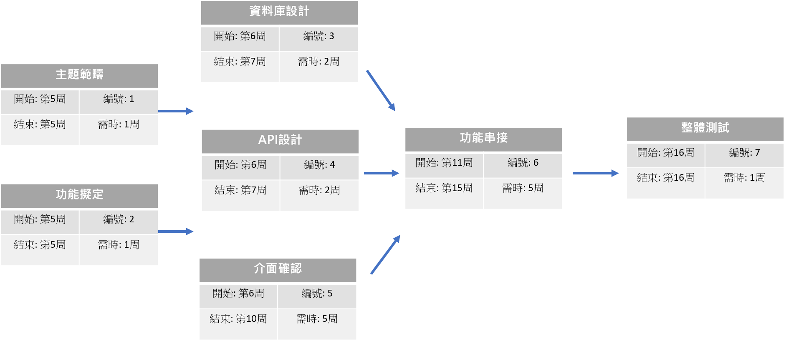
  
 ### 關鍵路徑: 1 -> 5 -> 6 -> 7
 
 

---

## 二、需求工程 -- FDD&需求分析&功能&非功能描述

 ### (1)FDD
 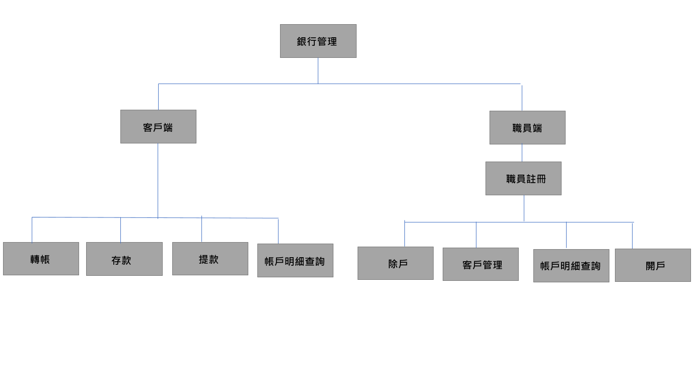
 
 ### (2)UseCase
 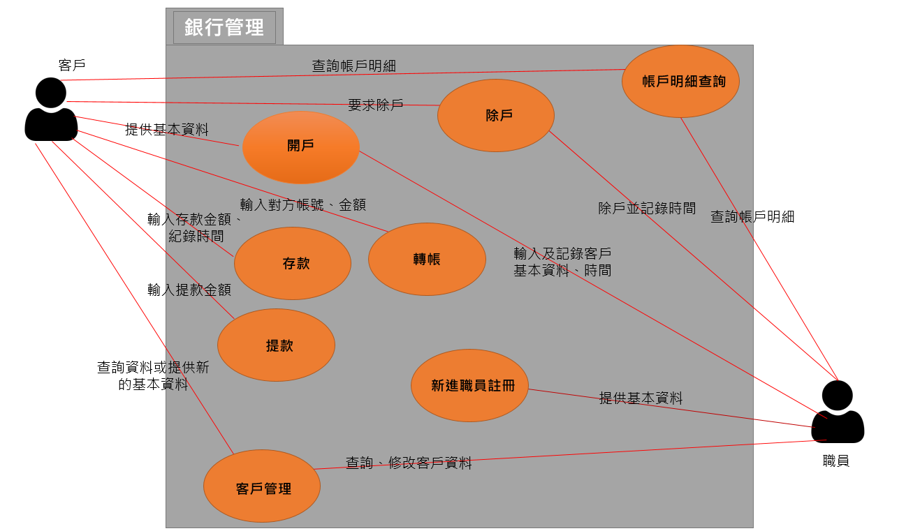
 
 ### (3)使用者案例

 ##### 1.
 | 使用案例名稱 |          新進職員註冊         |
 | :-----------|:---------------------|
 |行動者       |職員                   |
 |說明         |描述新進職員註冊過程            |
 |完成動作     |1.	職員點擊註冊並輸入基本資料 2.	資料庫紀錄職員資料並記錄職員註冊時間 3.	系統畫面顯示註冊完成   |
 |替代方法     |1.	其他職員點擊註冊並輸入基本資料 2.	資料庫紀錄職員資料併紀錄職員註冊時間 3.	系統畫面顯示註冊完成   |
 |先決條件 | 職員選擇註冊帳戶，並進入註冊流程 |
 |後置條件 | 職員帳戶註冊完成，職員可以登入使用其他功能 |
 |假設| 無 |
 
 ##### 2.
 | 使用案例名稱 |          開戶         |
 | :-----------|:---------------------|
 |行動者       |職員、客戶                   |
 |說明         |描述職員端幫客戶開戶過程            |
 |完成動作     |1.	職員點擊客戶開戶並輸入基本資料 2.	資料庫紀錄客戶資料並記錄開戶時間 3.	系統畫面顯示開戶完成   |
 |替代方法     |1.	職員點擊客戶開戶並輸入基本資料 2.	資料庫紀錄客戶資料並記錄開戶時間 3.	系統畫面顯示開戶完成   |
 |先決條件 | 職員選擇客戶註冊開戶，並進入開戶流程 |
 |後置條件 | 開戶註冊完成，客戶可以登入使用其他功能 |
 |假設| 無 |
 
 ##### 3.
 | 使用案例名稱 |          除戶         |
 | :-----------|:---------------------|
 |行動者       |職員、客戶                   |
 |說明         |描述職員端幫客戶除戶過程            |
 |完成動作     |1.	職員點擊客戶除戶 2.	資料庫刪除客戶資料並記錄除戶時間 3.	系統畫面顯示除戶完成   |
 |替代方法     |1.	職員點擊客戶除戶 2.	資料庫刪除客戶資料並記錄除戶時間 3.	系統畫面顯示除戶完成   |
 |先決條件 | 職員選擇客戶除戶，並進入除戶流程 |
 |後置條件 | 帳戶除戶完成，客戶將無法登入使用其他功能 |
 |假設| 無 |
 
 
 ##### 4.
 | 使用案例名稱 |          存款         |
 | :-----------|:---------------------|
 |行動者       |客戶                   |
 |說明         |描述客戶帳戶存款過程            |
 |完成動作     |1.	客戶點擊存款 2. 輸入存款的金額 3.	資料庫紀錄客戶存款金額和時間 4. 系統畫面顯示存款完成   |
 |替代方法     |1.	客戶點擊存款 2. 輸入存款的金額 3.	資料庫紀錄客戶存款金額和時間 4. 系統畫面顯示存款完成   |
 |先決條件 | 客戶需先登入並選擇存款，進入存款流程 |
 |後置條件 | 帳戶存款完成，客戶可以繼續使用其他功能 |
 |假設| 無 |
 
 ##### 5.
 | 使用案例名稱 |          提款         |
 | :-----------|:---------------------|
 |行動者       |客戶                   |
 |說明         |描述客戶帳戶提款過程            |
 |完成動作     |1.	客戶點擊提款 2. 輸入提款的金額 3.	確認客戶原先存款餘額是否足夠 4.	資料庫紀錄客戶提款金額和時間 5. 系統畫面顯示提款完成 6.	餘額不足時則顯示提款失敗  |
 |替代方法     |1.	客戶點擊提款 2. 輸入提款的金額 3.	確認客戶原先存款餘額是否足夠 4.	資料庫紀錄客戶提款金額和時間 5. 系統畫面顯示提款完成 6.	餘額不足時則顯示提款失敗   |
 |先決條件 | 客戶需先登入並選擇提款，進入提款流程 |
 |後置條件 | 帳戶提款完成，客戶可以繼續使用其他功能 |
 |假設| 無 |
 
 ##### 6.
 | 使用案例名稱 |          轉帳         |
 | :-----------|:---------------------|
 |行動者       |客戶                   |
 |說明         |描述客戶帳戶轉帳過程            |
 |完成動作     |1.	客戶點擊轉帳 2. 輸入轉帳的金額 3.	確認客戶原先存款餘額是否足夠 4.	資料庫紀錄客戶轉帳金額和雙方帳號及時間 5. 系統畫面顯示轉帳完成 6.	餘額不足時則顯示轉帳失敗  |
 |替代方法     |1.	客戶點擊轉帳 2. 輸入轉帳的金額 3.	確認客戶原先存款餘額是否足夠 4.	資料庫紀錄客戶轉帳金額和雙方帳號及時間 5. 系統畫面顯示轉帳完成 6.	餘額不足時則顯示轉帳失敗   |
 |先決條件 | 客戶選擇轉帳帳戶，並進入轉帳流程 |
 |後置條件 | 帳戶轉帳完成，客戶可以繼續使用其他功能 |
 |假設| 無 |
 
 ##### 7.
 | 使用案例名稱 |          客戶管理         |
 | :-----------|:---------------------|
 |行動者       |職員                   |
 |說明         |描述職員管理客戶帳戶過程            |
 |完成動作     |1.	職員點擊客戶管理並修改客戶資料 2.	資料庫紀錄客戶資料 3.	系統畫面顯示註冊完成  |
 |替代方法     |1.	職員點擊客戶管理並修改客戶資料 2.	資料庫紀錄客戶資料 3.	系統畫面顯示註冊完成   |
 |先決條件 | 客戶選擇註冊帳戶，並進入註冊流程 |
 |後置條件 | 帳戶註冊完成，客戶可以登入使用其他功能 |
 |假設| 無 |
 
 ##### 8.
 | 使用案例名稱 |          帳戶明細查詢         |
 | :-----------|:---------------------|
 |行動者       |客戶                   |
 |說明         |描述客戶查詢帳戶明細過程            |
 |完成動作     |1.	客戶點擊帳戶明細查詢 2.	系統畫面顯示帳戶明細  |
 |替代方法     |1.	點擊帳戶明細查詢 2.	系統畫面顯示帳戶明細   |
 |先決條件 | 客戶選擇帳戶明細查詢，並進入查詢流程 |
 |後置條件 | 帳戶查詢完成，客戶可以繼續使用其他功能 |
 |假設| 無 |
 
 ### (4)需求分析
 
 一個銀行管理系統的需求分析簡述如下:

1.管理者可以幫客戶開戶、儲戶、帳戶明細查詢。 
2.客戶可自行存款、轉帳、提款。 
3.如有新進職員，可以透過註冊功能來加入新職員。 
4.管理者可以藉由客戶管理來查詢、修改客戶資料。 
5.客戶及管理者都可以查詢帳號明細。 
6.任何對帳戶的異動，都必須記錄時間。 

 ### (5)功能性描述
 
 * 職員管理：
  > * 職員登入
  > * 新進職員註冊
 * 客戶管理
  > * 客戶登入
  > * 開戶
  > * 除戶
  > * 客戶管理資料
 * 交易明細管理：可查詢目前存提、轉帳、其他金流紀錄
  > * 職員管轄客戶之明細資料
  > * 帳戶明細
 * 轉帳：於不同帳戶之間進行金流移轉。
 
 ### (6)非功能性描述
 
 + 使用性：我們的操作介面非常簡單，使用者在操作過一次之後即可上手
 + 反應時間：Response Time < 3 sec
 + 可靠度：Down time < 1 /week
 + 安全性：不同的用戶具有不同的權限  (例：職員帳號可以進行顧客的開除戶、修改帳戶明細，併將修改的帳戶名稱、日期、摘要和更改內容記錄下來)
 + 系統設計所使用的環境/工具：PHP、HTML5、CSS3、SqlServer、JavaScript
 + 兼容性：系統應支持 Google Chrome、 Safari 、 Microsoft Edge 瀏覽器

---

## 三、資料與流程塑模 -- 資料流向圖DFD＆UML＆活動圖＆循序圖

 ### (1)資料流向圖 DFD
  #### 1.系統分析圖
   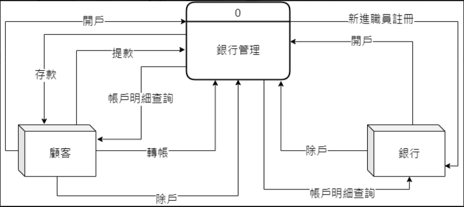

  #### 2.圖0
   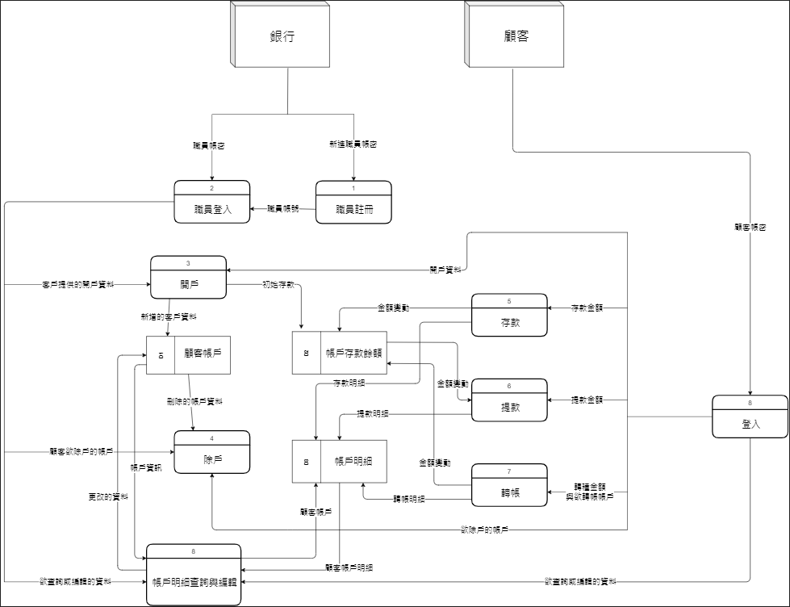
 

 ### (2)UML類別圖
  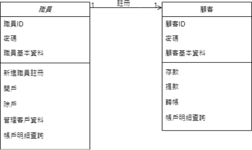

 ### (3)活動圖
  #### 1.新進員工註冊
   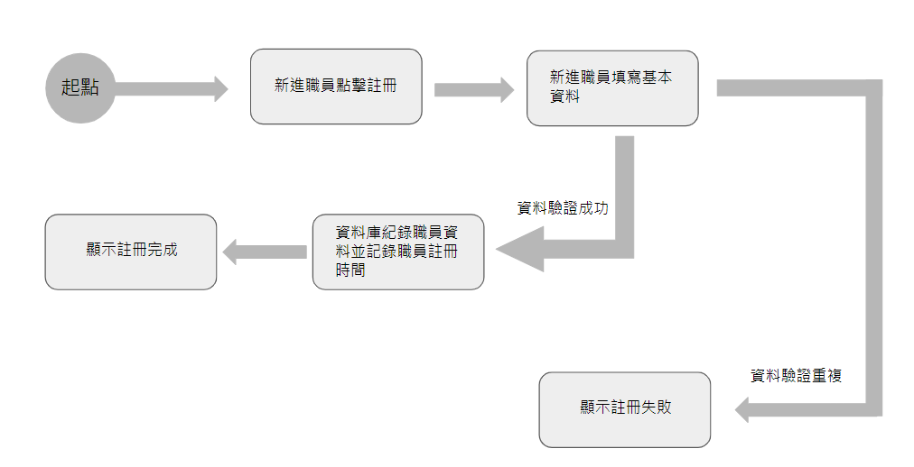
   
  #### 2.開戶
   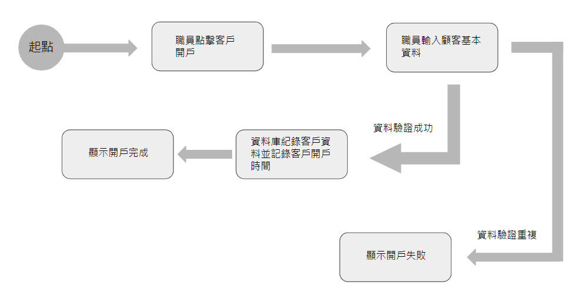
   
  #### 3.除戶
   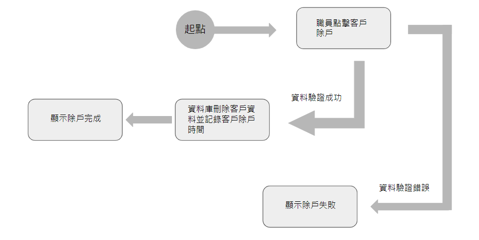
   
  #### 4.存款
   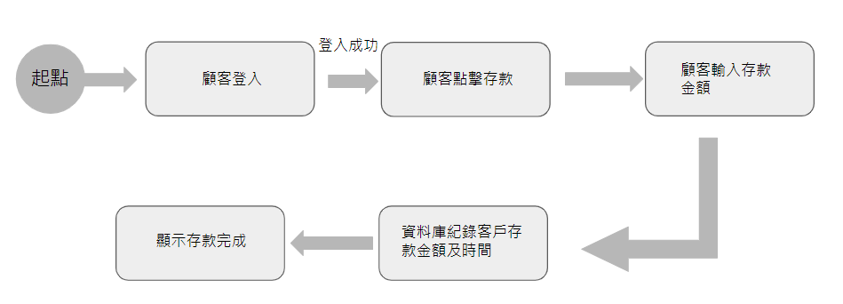
   
  #### 5.提款
   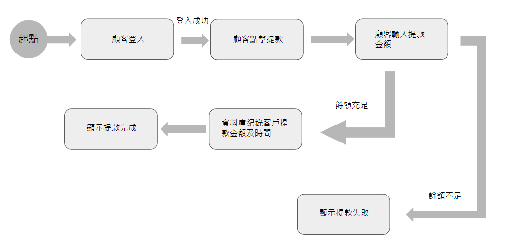
   
  #### 6.轉帳
   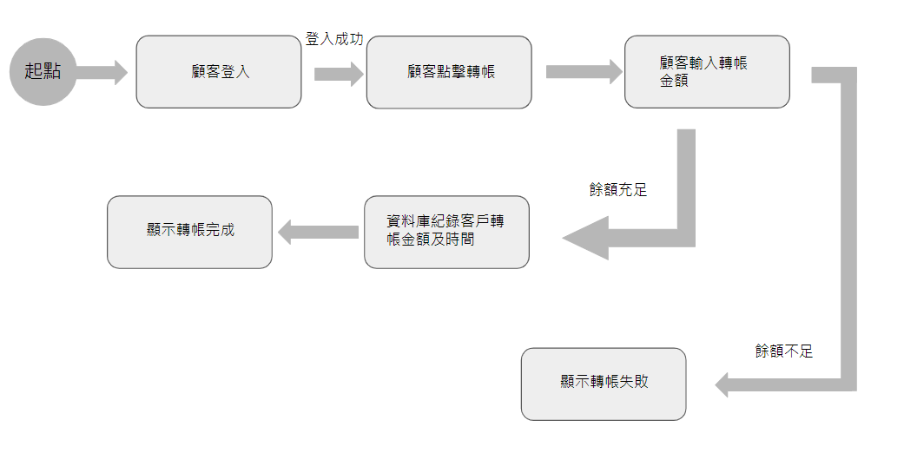
   
  #### 7.客戶管理
   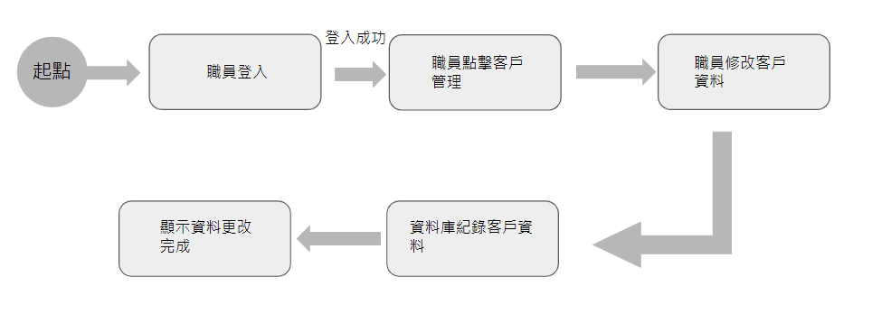
   
  #### 8.客戶明細查詢
   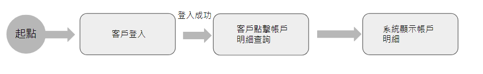
 
 
 ### (4)循序圖
  #### 1.新進員工註冊
   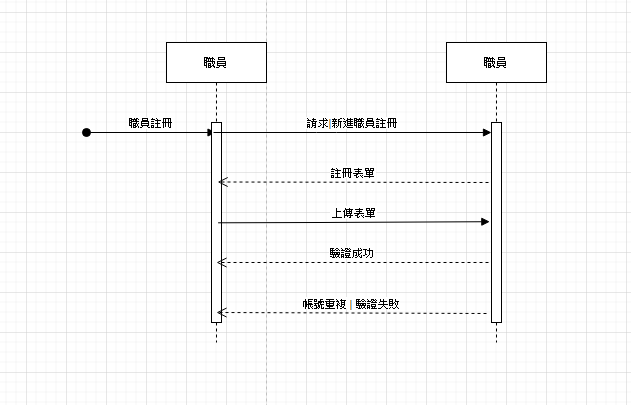
 
  #### 2.開戶
   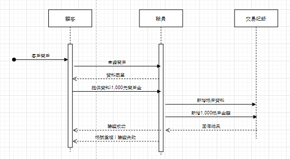
   
  #### 3.除戶
   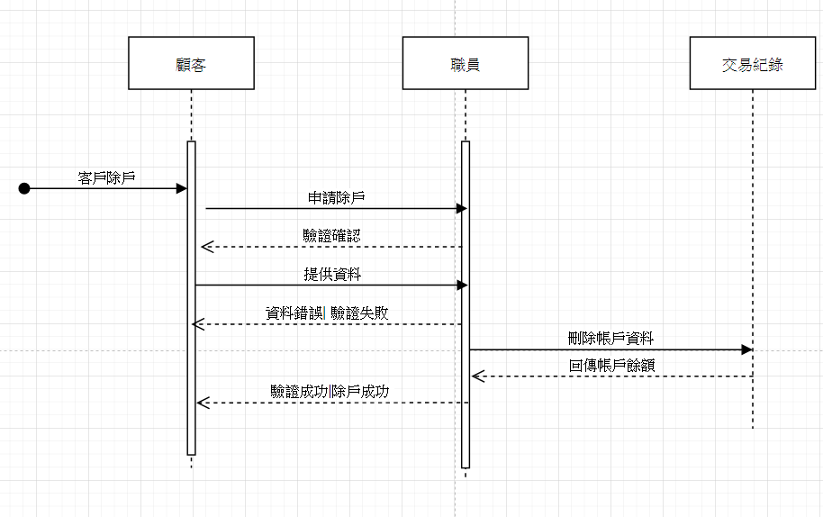
   
  #### 4.存款
   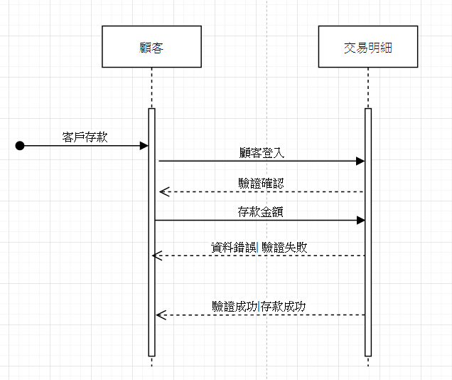
   
  #### 5.提款
   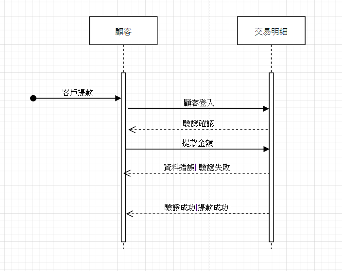
   
  #### 6.轉帳
   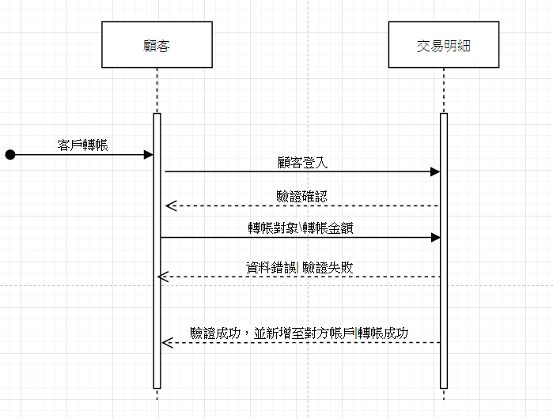
   
  #### 7.客戶管理
   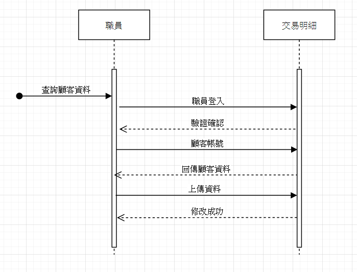
   
  #### 8.客戶明細查詢
   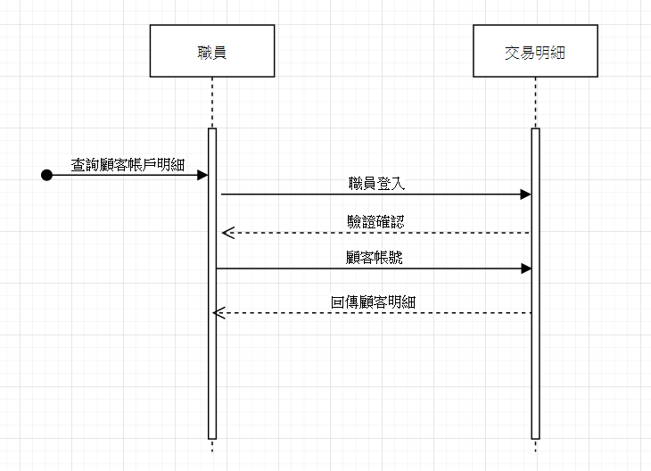
 
 ---
 
## 四、使用者介面 -- 分鏡圖&ERmodle
### (1)分鏡圖
#### 1.首頁
 
  | 介面名稱 |          首頁         |
| :-----------|:---------------------|
|客戶登入       |連結到客戶登入頁面。                   |
|職員登入       |連結到職員登入頁面。                   |

 #### 2.職員登入
 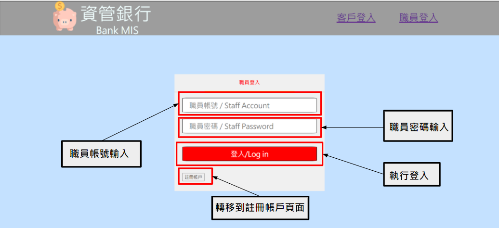
  | 介面名稱 |          職員登入         |
| :-----------|:---------------------|
|職員帳號輸入       |使用輸入框，主要用於輸入職員帳戶帳號。                   |
|職員密碼輸入       |使用輸入框，主要用於輸入職員帳戶密碼。                   |
|執行登入       |確認帳號是否存在，確認密碼是否為該帳號的密碼，確認後進入職員的操作介面。                   |
|註冊職員帳戶       |連結到職員註冊頁面。                   |

#### 3.職員註冊
 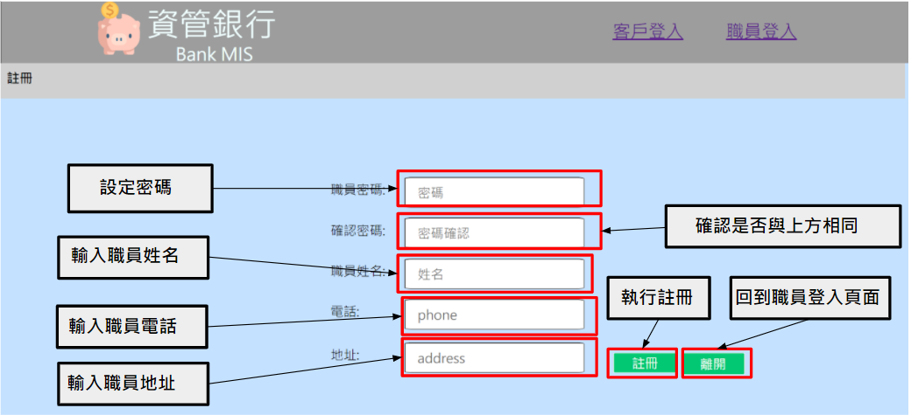
  | 介面名稱 |          職員註冊         |
| :-----------|:---------------------|
|設定密碼       |使用輸入框，主要用於輸入職員欲設定的密碼。                   |
|確認密碼       |使用輸入框，主要用於確認再次輸入的密碼是否與上方相同。                   |
|職員姓名       |使用輸入框，主要用於輸入職員姓名。                   |
|電話       |使用輸入框，主要用於輸入職員地址。                   |
|地址       |使用輸入框，主要用於輸入職員地址。                   |
|註冊       |確認該職員是否重複註冊，註冊成功後返回職員登入頁面。                   |
|離開       |返回職員登入頁面。                   |

#### 4.顧客管理
 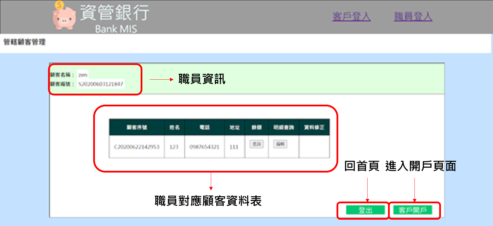
  | 介面名稱 |          顧客管理         |
| :-----------|:---------------------|
|顧客序號       |會顯示當前查詢的顧客序號。                  |
|姓名       |會顯示當前查詢的顧客姓名。                   |
|電話       |會顯示當前查詢的顧客電話。                   |                 |
|地址       |會顯示當前查詢的顧客地址。                   |
|餘額       |會顯示當前查詢的顧客餘額。                   |
|明細查詢       |會顯示當前查詢的顧客明細。                    |
|資料修正       |會顯示當前查詢的顧客上次修正資料的時間。                    |

#### 5.顧客交易明細
 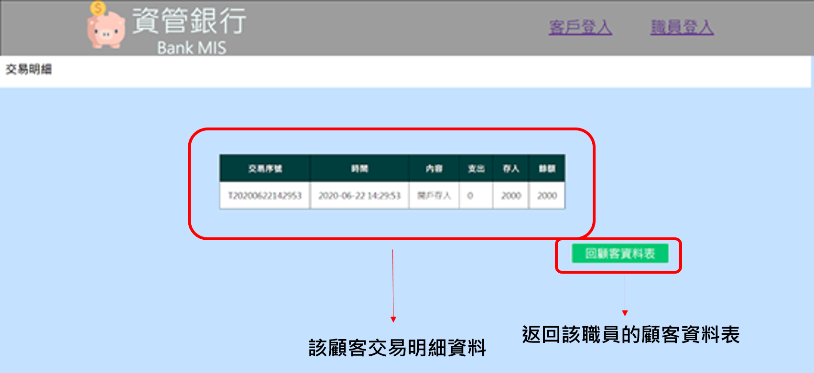
  | 介面名稱 |          顧客交易明細         |
| :-----------|:---------------------|
|交易序號       |會顯示當前查詢的交易序號。                   |
|時間       |會顯示當前查詢的交易時間。                   |
|內容       |會顯示當前查詢的交易內容。                   |
|支出       |會顯示當前查詢的交易支出。                   |
|收入       |會顯示當前查詢的交易收入。                   |
|餘額       |會顯示當前查詢的交易餘額。                   |

#### 6.編輯顧客個人資料
 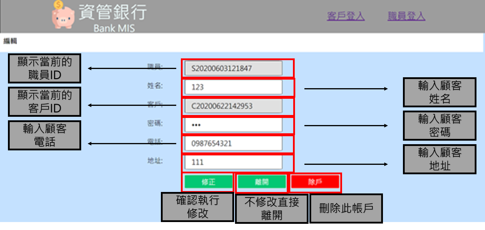
  | 介面名稱 |          編輯顧客個人資料         |
| :-----------|:---------------------|
|職員       |使用輸入框，主要用於顯示當前的職員ID。                   |
|姓名       |使用輸入框，主要用於輸入顧客姓名。                   |
|客戶       |使用輸入框，主要用於顯示當前的客戶ID。                   |
|密碼       |使用輸入框，主要用於輸入顧客密碼。                   |
|電話       |使用輸入框，主要用於輸入顧客電話。                   |
|地址       |使用輸入框，主要用於輸入顧客地址。                   |

#### 7.開戶頁面

| 欄位名稱 | 資料型態 | 驗證規則 | 備註說明 |
| -------- | -------- | -------- | --- |
| 職員     | string     |   順序檢查   |   每個職員都有自己對應的客戶，因此此欄位為readonly。幫客戶開戶前，必須先登入。  |
| 姓名     | string     | 順序檢查     |   不得為null  |
| 密碼     | string     | 順序檢查     |   不得為null  |
| 確認密碼     | string     | 順序檢查     |   不得為null且要與密碼欄位一致  |
| 電話    | string     | 順序檢查     |   不得為null  |
| 地址    | string     | 順序檢查     |  不得為null   |
| 開戶存款     | string     | 順序檢查     |  不得為null   |

#### 8.客戶登入頁面

| 欄位名稱 | 資料型態 | 驗證規則 |   備註說明  |
| -------- | -------- | -------- | --- |
|     客戶帳號     |    String      |   存在檢查、驗證檢查|   跟資料庫中的資料比對是否吻合  |
| 客戶密碼     | String     | 存在檢查、驗證檢查     |   跟資料庫中的資料比對是否吻合  |

#### 9.帳戶交易明細

| 欄位名稱 | 資料型態 | 驗證規則           | 備註說明                     |
| -------- | -------- | ------------------ | ---------------------------- |
| 交易序號 | String   | 無 |此頁面只用來查看 |
|     時間     |String|       無             | 此頁面只用來查看                             |
|     內容     |     String     |        無            |      此頁面只用來查看                        |
|     支出     |    String      |         無           |     此頁面只用來查看                         |
|      存入    |    String      |         無           |此頁面只用來查看|
|    餘額      |     String     |          無          |      此頁面只用來查看                        |
| 時間     | String   | 無 | 此頁面只用來查看  |

 #### 10.帳戶動作操作
 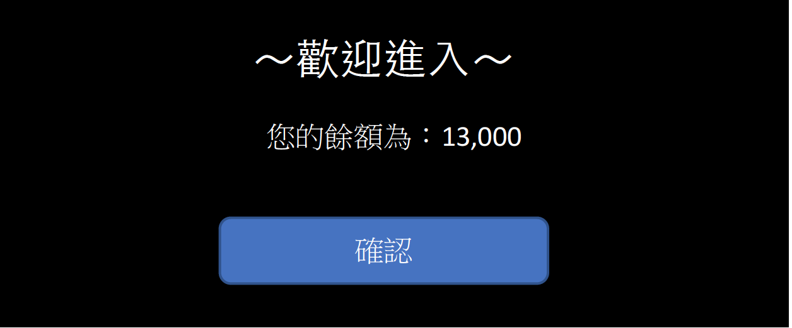
 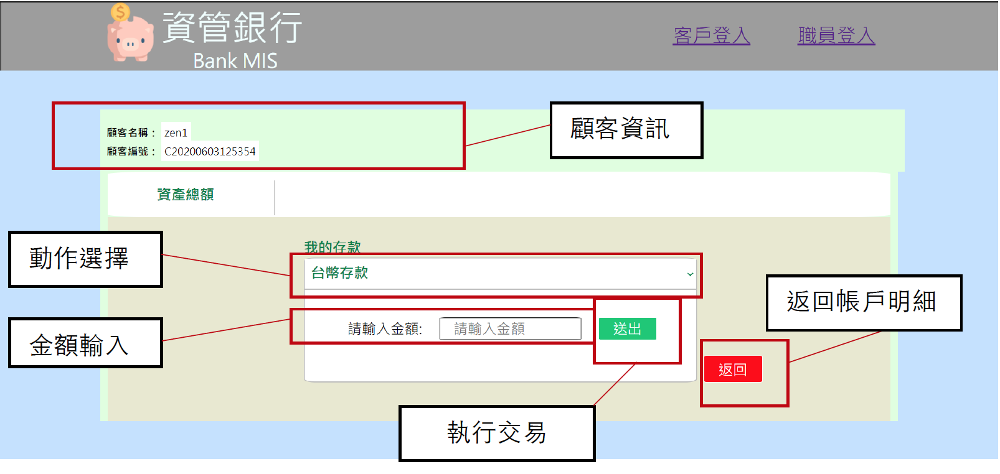
  | 介面名稱 |          簡介         |
| :-----------|:---------------------|
|顧客資訊       |會顯示當前使用系統的顧客資訊。                   |
|動作選擇       |使用下拉選單的方式，使顧客能夠選擇想要的交易動作，如：存、提款或是轉帳。                   |
|金額輸入       |使用輸入框，主要用於輸入金額，不可輸入小於零的數字。若輸入小於零的數字，在點擊送出時，會跳出警告，輸入框會呈現紅色字體。|
|執行交易       |會偵測目前帳戶額度與金額欄位的資料是否正確，若是金額小於零會跳出警示；餘額不足會跳出提示窗，提醒餘額不足。                   |
|返回帳戶明細    |返回上一頁的功能，會跳出確認框確認是否要離開。                   |

 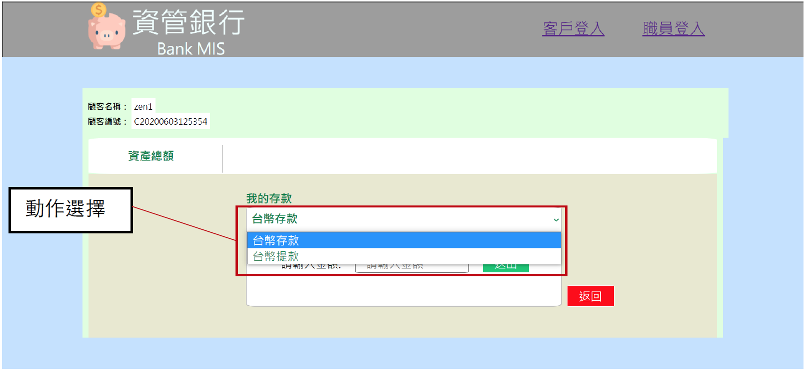
 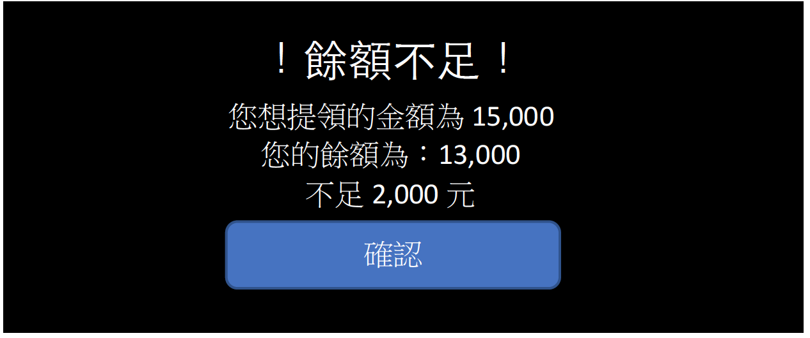
 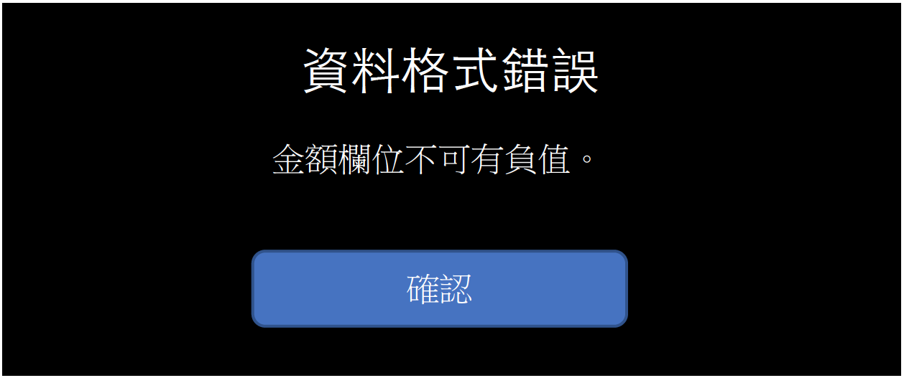
 

 ### (2)ERmodle
 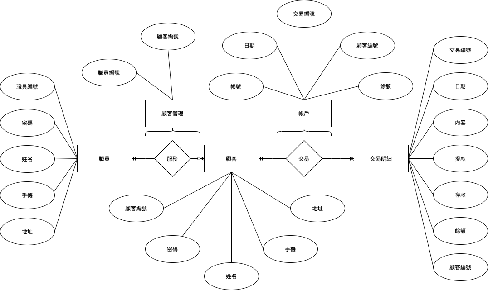
